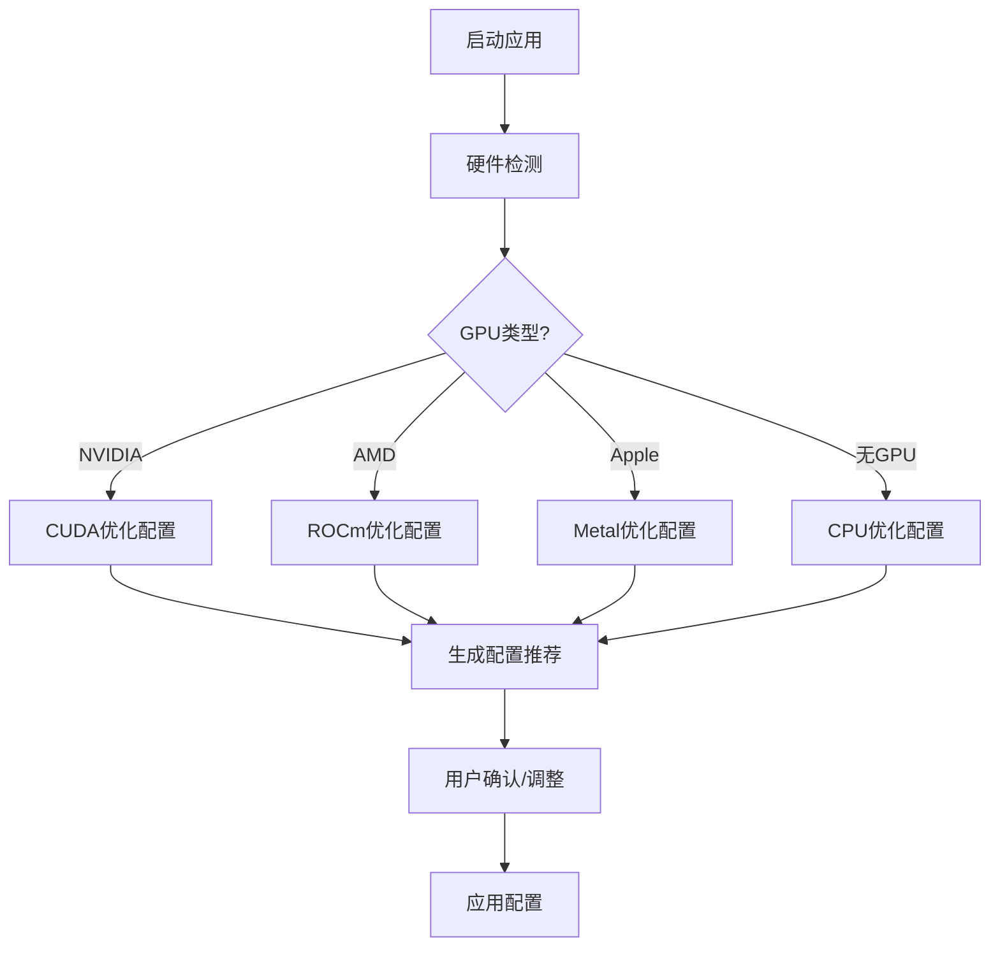

# 本地模型优化平台 - 项目方案设计

## 一、项目定位

### 项目名称
**LocalAI Optimizer** (本地AI优化器)

### 核心理念
> 让本地AI模型的使用像云端一样简单，像专业调优一样高效

### 目标用户
- **个人开发者**：需要在本地运行AI模型进行开发和测试
- **AI爱好者**：想要体验各种开源模型但配置经验有限
- **小型团队**：需要在内部部署AI能力但资源有限
- **隐私敏感用户**：需要离线运行但希望获得最佳性能

---

## 二、核心功能设计

### 2.1 智能硬件检测与配置推荐



**功能细节：**
- 自动检测GPU型号、显存大小、CUDA版本
- 检测系统内存、CPU核心数、存储类型
- 基于硬件配置推荐：
  - 最大可运行的模型大小
  - 推荐的量化级别
  - 上下文长度建议
  - 批处理大小建议

### 2.2 统一模型管理

**模型仓库功能：**
```
models/
├── llm/
│   ├── llama-3-8b/
│   │   ├── q4_k_m.gguf
│   │   ├── q5_k_s.gguf
│   │   └── metadata.json
│   └── qwen2-7b/
│       └── ...
├── vision/
│   └── llava-1.6/
├── audio/
│   └── whisper-large-v3/
└── index.json  # 模型索引
```

**核心能力：**
- **模型发现**：自动扫描本地模型文件，识别格式和参数
- **元数据管理**：记录模型来源、版本、性能指标
- **格式转换**：一键转换不同格式(Safetensors → GGUF)
- **版本管理**：支持模型版本切换和回滚
- **下载管理**：集成HuggingFace Hub，支持断点续传

### 2.3 自适应推理引擎

**智能调度策略：**

| 任务类型 | 推荐模型 | 量化策略 | 优化重点 |
|----------|----------|----------|----------|
| 简单问答 | 小模型(1-3B) | Q4_K_S | 速度优先 |
| 代码生成 | 代码模型(7B) | Q5_K_M | 平衡模式 |
| 长文分析 | 长上下文模型 | Q4_K_M | 内存优化 |
| 创意写作 | 大模型(13B+) | Q3_K_L | 质量优先 |

**动态优化：**
- **运行时量化**：根据负载动态调整推理精度
- **KV Cache管理**：智能缓存复用，减少重复计算
- **批处理优化**：合并多个请求，提高吞吐量
- **模型预热**：常用模型保持在内存中

### 2.4 性能监控与调优

**实时监控指标：**
```
┌─────────────────────────────────────────────────┐
│  性能监控面板                                      │
├─────────────────────────────────────────────────┤
│  模型: llama-3-8b-q4_k_m                         │
│  状态: 运行中 ✓                                   │
├─────────────────────────────────────────────────┤
│  推理速度: 45.2 tokens/s                          │
│  首Token延迟: 128ms                               │
│  显存占用: 5.2GB / 8GB (65%)                      │
│  内存占用: 3.1GB / 16GB (19%)                     │
│  GPU温度: 72°C                                    │
├─────────────────────────────────────────────────┤
│  请求统计:                                        │
│  - 总请求数: 1,234                                │
│  - 平均响应时间: 2.3s                             │
│  - 缓存命中率: 45%                                │
└─────────────────────────────────────────────────┘
```

**调优建议引擎：**
- 分析性能瓶颈(GPU/CPU/内存/IO)
- 提供参数调整建议
- 预测配置变更的影响
- 历史性能趋势分析

### 2.5 API兼容层

**OpenAI API兼容：**
```python
# 无缝替换OpenAI API
import openai

client = openai.OpenAI(
    base_url="http://localhost:8080/v1",
    api_key="not-needed"
)

response = client.chat.completions.create(
    model="llama-3-8b",  # 本地模型
    messages=[{"role": "user", "content": "Hello!"}]
)
```

**支持的API端点：**
- `/v1/chat/completions` - 聊天补全
- `/v1/completions` - 文本补全
- `/v1/embeddings` - 文本嵌入
- `/v1/models` - 模型列表
- `/v1/images/generations` - 图像生成

---

## 三、技术架构

### 3.1 系统架构图

```
┌─────────────────────────────────────────────────────────────┐
│                      用户界面层                              │
│  ┌──────────┐  ┌──────────┐  ┌──────────┐  ┌──────────┐    │
│  │ Web UI   │  │ CLI      │  │ REST API │  │ SDK      │    │
│  └──────────┘  └──────────┘  └──────────┘  └──────────┘    │
└─────────────────────────────────────────────────────────────┘
                              │
                              ▼
┌─────────────────────────────────────────────────────────────┐
│                      服务编排层                              │
│  ┌──────────────┐  ┌──────────────┐  ┌──────────────┐      │
│  │ 请求路由     │  │ 负载均衡     │  │ 会话管理     │      │
│  └──────────────┘  └──────────────┘  └──────────────┘      │
└─────────────────────────────────────────────────────────────┘
                              │
                              ▼
┌─────────────────────────────────────────────────────────────┐
│                      优化引擎层                              │
│  ┌──────────────┐  ┌──────────────┐  ┌──────────────┐      │
│  │ 智能调度     │  │ 内存管理     │  │ 性能监控     │      │
│  └──────────────┘  └──────────────┘  └──────────────┘      │
└─────────────────────────────────────────────────────────────┘
                              │
                              ▼
┌─────────────────────────────────────────────────────────────┐
│                      推理后端层                              │
│  ┌──────────┐  ┌──────────┐  ┌──────────┐  ┌──────────┐    │
│  │llama.cpp │  │ vLLM     │  │ONNX RT   │  │ 自定义   │    │
│  └──────────┘  └──────────┘  └──────────┘  └──────────┘    │
└─────────────────────────────────────────────────────────────┘
                              │
                              ▼
┌─────────────────────────────────────────────────────────────┐
│                      硬件抽象层                              │
│  ┌──────────┐  ┌──────────┐  ┌──────────┐  ┌──────────┐    │
│  │ NVIDIA   │  │ AMD      │  │ Apple    │  │ CPU      │    │
│  │ CUDA     │  │ ROCm     │  │ Metal    │  │ AVX/NEON │    │
│  └──────────┘  └──────────┘  └──────────┘  └──────────┘    │
└─────────────────────────────────────────────────────────────┘
```

### 3.2 核心模块设计

#### 模块1：硬件检测器 (HardwareDetector)
```python
class HardwareDetector:
    """硬件检测与配置推荐"""

    def detect(self) -> HardwareProfile:
        return HardwareProfile(
            gpu=self._detect_gpu(),
            cpu=self._detect_cpu(),
            memory=self._detect_memory(),
            storage=self._detect_storage()
        )

    def recommend_config(self, profile: HardwareProfile) -> ModelConfig:
        """基于硬件推荐最优配置"""
        pass
```

#### 模块2：模型管理器 (ModelManager)
```python
class ModelManager:
    """统一模型管理"""

    def scan_local_models(self) -> List[ModelInfo]:
        """扫描本地模型文件"""
        pass

    def download_model(self, model_id: str) -> Path:
        """从HuggingFace下载模型"""
        pass

    def convert_format(self, model: ModelInfo, target: str) -> Path:
        """模型格式转换"""
        pass
```

#### 模块3：推理调度器 (InferenceScheduler)
```python
class InferenceScheduler:
    """智能推理调度"""

    def select_model(self, task: Task) -> ModelInfo:
        """根据任务选择最优模型"""
        pass

    def schedule_request(self, request: Request) -> Future:
        """调度推理请求"""
        pass

    def optimize_batch(self, requests: List[Request]) -> Batch:
        """优化批处理"""
        pass
```

#### 模块4：性能优化器 (PerformanceOptimizer)
```python
class PerformanceOptimizer:
    """性能监控与优化"""

    def collect_metrics(self) -> Metrics:
        """收集性能指标"""
        pass

    def analyze_bottleneck(self, metrics: Metrics) -> Bottleneck:
        """分析性能瓶颈"""
        pass

    def suggest_optimization(self, bottleneck: Bottleneck) -> List[Suggestion]:
        """提供优化建议"""
        pass
```

---

## 四、技术栈选型

### 4.1 后端技术

| 组件 | 技术选型 | 理由 |
|------|----------|------|
| **主语言** | Python 3.11+ | 生态丰富，AI库支持好 |
| **性能关键部分** | C/C++ (pybind11) | 推理核心、内存管理 |
| **异步框架** | FastAPI + uvicorn | 高性能异步API |
| **任务队列** | Celery + Redis | 异步任务处理 |
| **数据库** | SQLite + SQLAlchemy | 轻量级本地存储 |
| **缓存** | Redis / 内存缓存 | KV Cache、元数据缓存 |

### 4.2 前端技术

| 组件 | 技术选型 | 理由 |
|------|----------|------|
| **Web框架** | React + TypeScript | 组件化，类型安全 |
| **UI库** | Ant Design / Shadcn | 成熟的组件库 |
| **状态管理** | Zustand | 轻量级状态管理 |
| **图表** | Recharts | 性能监控可视化 |
| **桌面版** | Electron / Tauri | 跨平台桌面应用 |

### 4.3 推理后端

| 后端 | 适用场景 | 集成方式 |
|------|----------|----------|
| **llama.cpp** | 通用LLM推理 | Python binding (llama-cpp-python) |
| **vLLM** | 高吞吐服务 | API集成 |
| **ONNX Runtime** | 跨平台推理 | Python SDK |
| **OpenVINO** | Intel设备优化 | Python SDK |
| **MLC LLM** | 移动端/边缘设备 | API集成 |

---

## 五、开发路线图

### Phase 1: 基础框架 (4周)

**目标：** 建立核心架构，实现基本功能

- [ ] 项目脚手架搭建
- [ ] 硬件检测模块
- [ ] 基础模型管理(扫描、加载)
- [ ] llama.cpp集成
- [ ] 简单的CLI接口
- [ ] 基础API服务

**交付物：**
- 可运行的命令行工具
- 基本的模型加载和推理功能
- 硬件检测和配置推荐

### Phase 2: 核心优化 (4周)

**目标：** 实现智能优化功能

- [ ] 智能量化策略
- [ ] 内存管理优化
- [ ] KV Cache优化
- [ ] 性能监控系统
- [ ] 调优建议引擎
- [ ] OpenAI API兼容层

**交付物：**
- 自动配置推荐
- 实时性能监控
- API兼容接口

### Phase 3: 用户界面 (4周)

**目标：** 提供友好的用户界面

- [ ] Web管理界面
- [ ] 模型市场/浏览器
- [ ] 可视化性能面板
- [ ] 配置管理界面
- [ ] 模型转换工具

**交付物：**
- 完整的Web界面
- 模型管理功能
- 性能可视化

### Phase 4: 高级功能 (4周)

**目标：** 实现差异化功能

- [ ] 多模型智能调度
- [ ] 模型热切换
- [ ] 工作流编排
- [ ] 插件系统
- [ ] 社区模型分享

**交付物：**
- 多模型管理
- 工作流功能
- 插件机制

### Phase 5: 打磨与发布 (4周)

**目标：** 完善产品，准备发布

- [ ] 性能优化和测试
- [ ] 文档编写
- [ ] 打包和分发
- [ ] 社区建设
- [ ] 持续迭代

**交付物：**
- 稳定的正式版本
- 完整的文档
- 安装包和分发渠道

---

## 六、竞争优势分析

### 与现有工具对比

| 特性 | LocalAI Optimizer | Ollama | LM Studio | text-gen-webui |
|------|-------------------|--------|-----------|----------------|
| **智能配置推荐** | ✅ 自动检测 | ❌ 手动 | ⚠️ 部分 | ❌ 手动 |
| **多后端支持** | ✅ 统一接口 | ❌ 单一 | ❌ 单一 | ⚠️ 有限 |
| **性能监控** | ✅ 实时面板 | ❌ 无 | ⚠️ 基础 | ⚠️ 基础 |
| **调优建议** | ✅ AI驱动 | ❌ 无 | ❌ 无 | ❌ 无 |
| **多模型调度** | ✅ 智能路由 | ❌ 无 | ❌ 无 | ❌ 无 |
| **API兼容** | ✅ OpenAI | ✅ OpenAI | ✅ OpenAI | ✅ OpenAI |
| **工作流编排** | ✅ 支持 | ❌ 无 | ❌ 无 | ❌ 无 |
| **插件系统** | ✅ 支持 | ❌ 无 | ❌ 无 | ⚠️ 有限 |

### 核心差异化

1. **智能配置推荐** - 唯一提供基于硬件的自动配置
2. **统一多后端** - 支持多种推理后端，用户无感知切换
3. **AI驱动调优** - 使用AI分析性能瓶颈并提供优化建议
4. **工作流编排** - 支持多模型协作的复杂任务

---

## 七、风险与挑战

### 技术风险

| 风险 | 影响 | 缓解措施 |
|------|------|----------|
| 推理后端API变化 | 高 | 抽象层隔离，快速适配 |
| 硬件兼容性问题 | 中 | 渐进式支持，社区反馈 |
| 性能优化难度 | 高 | 专注核心场景，逐步扩展 |
| 模型格式碎片化 | 中 | 优先支持主流格式 |

### 市场风险

| 风险 | 影响 | 缓解措施 |
|------|------|----------|
| 竞品快速迭代 | 高 | 差异化定位，快速迭代 |
| 用户需求变化 | 中 | 持续用户调研，灵活调整 |
| 技术栈过时 | 低 | 模块化设计，易于替换 |

---

## 八、总结

LocalAI Optimizer 项目旨在解决本地AI模型使用的痛点，通过智能配置推荐、统一模型管理、自适应推理优化等功能，让用户能够更高效地使用本地AI模型。

**核心价值主张：**
- 🎯 **简单** - 一键部署，智能配置
- ⚡ **高效** - 自动优化，性能最大化
- 🔧 **灵活** - 多后端支持，按需选择
- 📊 **可观测** - 实时监控，智能调优

**下一步行动：**
1. 确认项目方向和优先级
2. 搭建开发环境和项目脚手架
3. 实现Phase 1基础功能
4. 收集用户反馈，持续迭代

---

*文档版本：v1.0*
*创建时间：2026年5月29日*
